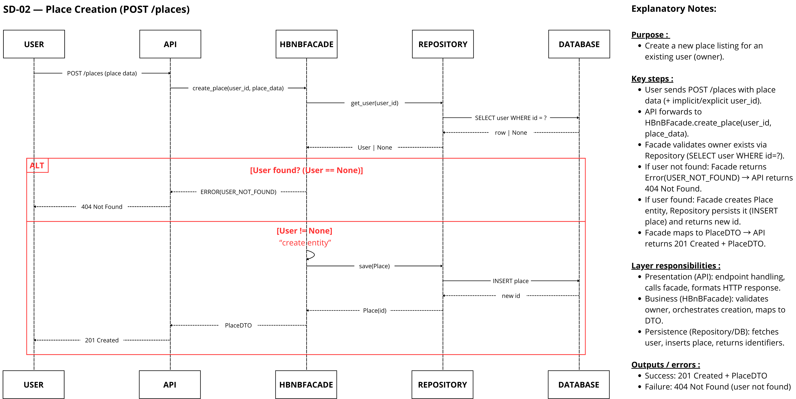

# 🏗 HBnB Evolution – Technical Documentation (Part 1)

---

# 📘 Overview

This document provides the complete architectural and technical foundation of the **HBnB Evolution** application.

It consolidates:

- High-level architecture
- Business Logic design
- API interaction sequence diagrams
- Design decisions and applied principles

The objective is to ensure clarity, structural consistency, and strict compliance with the project requirements before implementation.

---

# 1️⃣ Project Scope

HBnB Evolution is a simplified AirBnB-like application allowing:

- **User Management** (registration, update, deletion, admin role)
- **Place Management** (creation, update, deletion, listing)
- **Review Management** (creation, update, deletion, listing by place)
- **Amenity Management** (creation, update, deletion, listing)

The system follows:

- **Layered Architecture**
- **Facade Design Pattern**
- Controlled dependency direction between layers

All entities are uniquely identified using **UUID4** and include audit fields (`created_at`, `updated_at`).

---

# 2️⃣ High-Level Architecture

## 📦 High-Level Package Diagram

  

  <a href="./docs/high_level/High_level_package_diagram_HBNB.pdf">📄 View Full PDF Version</a>

## 🎯 Purpose

This diagram illustrates:

- The three architectural layers
- Controlled dependency direction
- The Facade as the single entry point to the Business Logic Layer

### Layers

- **Presentation Layer** (API, Services)
- **Business Logic Layer** (Models, Core Logic, Facade)
- **Persistence Layer** (Repositories, Database Access)

The Presentation Layer communicates exclusively with the Business Logic Layer through the **Facade**.

---

# 3️⃣ Business Logic Layer

## 📊 Class Diagram

  

  <a href="./docs/class_diagram/Class_diagram_for_business_Logic_Layer_HBNB.pdf">📄 View Full PDF Version</a>

## 🎯 Purpose

Defines:

- Core domain entities
- Attributes (strictly aligned with requirements)
- Inheritance hierarchy
- Relationships and multiplicities
- Business constraints

---

## 🔑 Core Entities

### BaseModel (Abstract)

Shared attributes for all entities:

- `id: UUID4`
- `created_at: datetime`
- `updated_at: datetime`

Ensures:
- Unique identification
- Audit tracking
- Reusability across domain models

---

### User

Attributes:

- `first_name: string`
- `last_name: string`
- `email: string`
- `password: string`
- `is_admin: bool`

Responsibilities:

- Can create, update, and delete their profile
- Owns multiple Places
- Writes multiple Reviews

---

### Place

Attributes:

- `title: string`
- `description: string`
- `price: float`
- `latitude: float`
- `longitude: float`
- `owner_id: UUID4`

Responsibilities:

- Belongs to a User (owner)
- Can be created, updated, deleted, and listed
- Linked to multiple Amenities
- Receives multiple Reviews

---

### Review

Attributes:

- `rating: int`
- `comment: string`
- `user_id: UUID4`
- `place_id: UUID4`

Responsibilities:

- Linked to a specific User
- Linked to a specific Place
- Can be created, updated, deleted, and listed by place

---

### Amenity

Attributes:

- `name: string`
- `description: string`

Responsibilities:

- Can be created, updated, deleted, and listed
- Associated with multiple Places

---

## 🔗 Cardinalities

- User (1) → (*) Place
- User (1) → (*) Review
- Place (1) → (*) Review
- Place (*) ↔ (*) Amenity

---

## ⚙ Business Rules

- Each entity must have a unique UUID4 identifier
- All entities track creation and update timestamps
- Rating must be between 1 and 5
- Only registered users can create places
- Only registered users can write reviews
- Each review must reference an existing place
- Each place must reference a valid owner (User)

---

# 4️⃣ API Interaction Sequence Diagrams

---

# SD-01 — User Registration (POST `/users`)

  

  <a href="./docs/sequence_diagram/Sequence_SD01_User_Registration.pdf">📄 View Full PDF Version</a>

### Flow Summary

1. POST request received
2. Email uniqueness verified
3. User entity created
4. Persisted in database
5. 201 Created returned

---

# SD-02 — Place Creation (POST `/places`)

  

  <a href="./docs/sequence_diagram/Sequence_SD02_Place_Creation.pdf">📄 View Full PDF Version</a>

### Flow Summary

1. Authenticated request received
2. Owner existence verified
3. Place entity created
4. Persisted
5. 201 Created returned

---

# SD-03 — Review Submission (POST `/places/{id}/reviews`)

  

  <a href="./docs/sequence_diagram/Sequence_SD03_Review_Submission.pdf">📄 View Full PDF Version</a>

### Flow Summary

1. Place existence verified
2. User existence verified
3. Rating validated (1–5)
4. Review persisted
5. 201 Created returned

---

# SD-04 — Fetching Places (GET `/places`)

  

  <a href="./docs/sequence_diagram/Sequence_SD04_Fetching_Places.pdf">📄 View Full PDF Version</a>

### Flow Summary

1. GET request received
2. Filters applied
3. Data retrieved from persistence layer
4. 200 OK returned

---

# 5️⃣ Architectural Principles Applied

- Layered Architecture
- Separation of Concerns
- Facade Pattern
- Dependency Direction Control
- Database Isolation
- Inheritance via BaseModel
- UUID-based entity identification

---

# 6️⃣ Conclusion

This document defines the complete architectural and structural foundation of HBnB Evolution.

It ensures:

- Maintainability
- Scalability
- Traceability of business rules
- Strict alignment with project requirements

---

## 👥 Authors

- Antoine Gousset – GitHub: [Antgst](https://github.com/Antgst)
- Gwendal Boisard – GitHub: [Gwendal-B](https://github.com/Gwendal-B)
- Yonas Houriez – GitHub: [Ausaryu](https://github.com/Ausaryu)

See `AUTHORS`.
