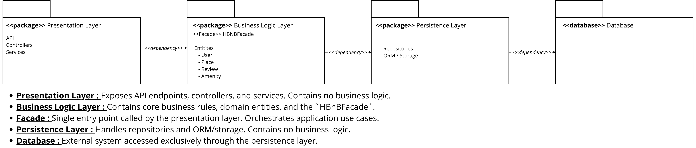
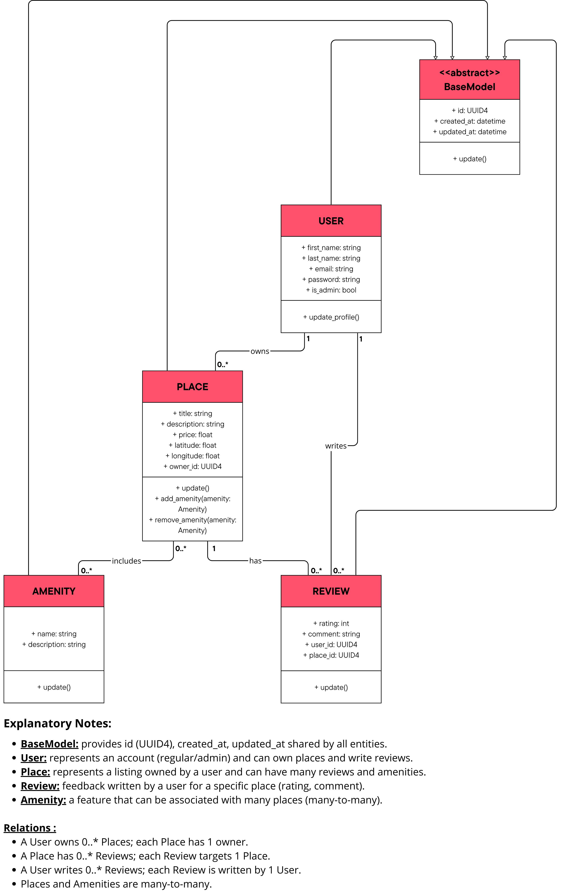
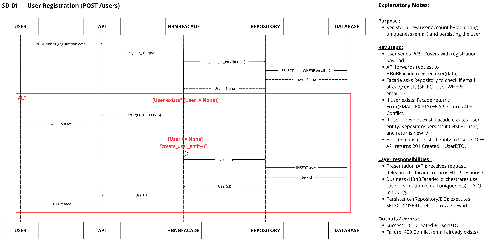
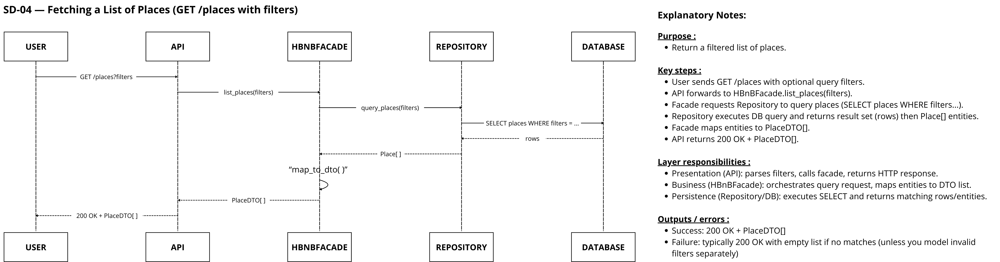

# 🏗 HBnB Evolution – Technical Documentation (Part 1)

## 📌 Overview

This document provides the architectural and design blueprint for the **HBnB Evolution** application.  
It defines the system structure, core business entities, and interaction flow across layers.

The application follows a **layered architecture** and applies the **Facade design pattern**.

---

# 1️⃣ High-Level Architecture

## 📦 High-Level Package Diagram

  

  <a href="./High_level_package_diagram_HBNB.pdf">📄 View Full PDF Version</a>

---

# 2️⃣ Business Logic Design

## 📊 Detailed Class Diagram

  

  <a href="./Class_diagram_for_business_Logic_Layer_HBNB.pdf">📄 View Full PDF Version</a>

---

# 3️⃣ Sequence Diagrams

---

## SD-01 — User Registration (POST `/users`)

  

  <a href="./Sequence_SD01_User_Registration.pdf">📄 View Full PDF Version</a>

---

## SD-02 — Place Creation (POST `/places`)

  

  <a href="./Sequence_SD02_Place_Creation.pdf">📄 View Full PDF Version</a>

---

## SD-03 — Review Submission (POST `/places/{id}/reviews`)

  

  <a href="./Sequence_SD03_Review_Submission.pdf">📄 View Full PDF Version</a>

---

## SD-04 — Fetching a List of Places (GET `/places`)

  

  <a href="./Sequence_SD04_Fetching_Places.pdf">📄 View Full PDF Version</a>

---

# 📚 Design Principles Applied

- Layered Architecture  
- Separation of Concerns  
- Facade Pattern  
- Dependency Direction Control  
- Database Isolation  
- Entity Inheritance (BaseModel abstraction)
